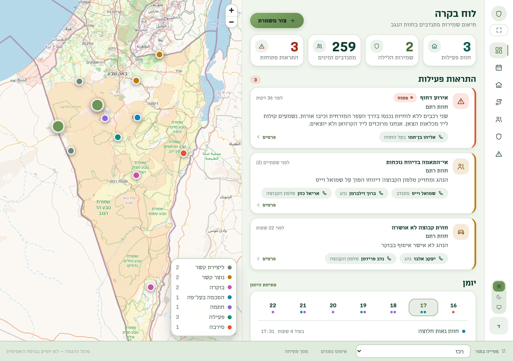

# לא ינום — Lo Yanum

> הִנֵּה לֹא יָנוּם וְלֹא יִישָׁן שׁוֹמֵר יִשְׂרָאֵל — תהלים קכ"א, ד

Coordination tool for a volunteer farm-protection programme in the Negev, built
for **[Artzenu](https://artzenu.org.il)** (ארצנו) and its שומרים בחוות programme.
**Lot 0.8: the app wears the Artzenu brand charter — palette, typography and mark
extracted from the association's own site. Full UI, realistic mock data, no backend.**

**Live preview: https://azmer-fts.github.io/lo-yanum/**



## Run

This machine has no Node.js; use Bun.

```bash
bun install && bun run dev
```

| Command | What it does |
|---|---|
| `bun run dev` | Dev server on http://localhost:5173 |
| `bun run build` | Typecheck + production build to `dist/` |
| `bun run typecheck` | `tsc --noEmit` |
| `bun run contrast` | WCAG audit of the design tokens |
| `bun run dispatch` | Verify the guard-scoring rules |
| `bun run accept` | Acceptance criteria, driven through the business layer |
| `bun run layout` | 390 px overflow sweep over every screen (dev server must be running) |
| `bun run screenshots` | Regenerate `docs/screenshots/` (dev server must be running) |
| `bun run brand-reference` | Re-capture `docs/brand/` from the live artzenu.org.il (needs the internet) |

Pick an identity on the landing screen, or switch roles any time from the bar
at the bottom of every screen.

## Architecture in one paragraph

`/src/core` is pure TypeScript with zero React and zero DOM — types, mock data,
the observable store, route planning, guard scoring, message generation, import
validation, WCAG maths, and the role-filtered accessors. `/src/ui` is every React component. Screens
never filter data by role; they call an accessor in `src/core/access.ts`, each
of which maps 1:1 to a future Supabase RLS policy. All UI copy lives in
`src/locales/he.json`; every colour lives in `src/styles/tokens.css`, which holds
both the light and dark palettes under the same semantic names — each hue as a
`--x` fill / `--x-ink` text pair. Four `--brand-*` tokens quote the Artzenu
charter verbatim and everything else is derived from them; the hidden
`/styleguide` route shows the whole system with its measured contrast ratios.

**Where the colours and fonts come from: [docs/brand-artzenu.md](docs/brand-artzenu.md)** —
provenance for every value, the three places WCAG AA forced an adjustment, and
the font-licence question that has to be settled before real users see the app.

## Mock data

All data is fictional. Phone numbers use the unallocated `05X-000NNNN` range so
no fixture can collide with a real number. Real emergency numbers (100/101/102)
are intentionally real.

**Full project state, design tokens, decisions and next steps: [ETAT.md](ETAT.md).**
