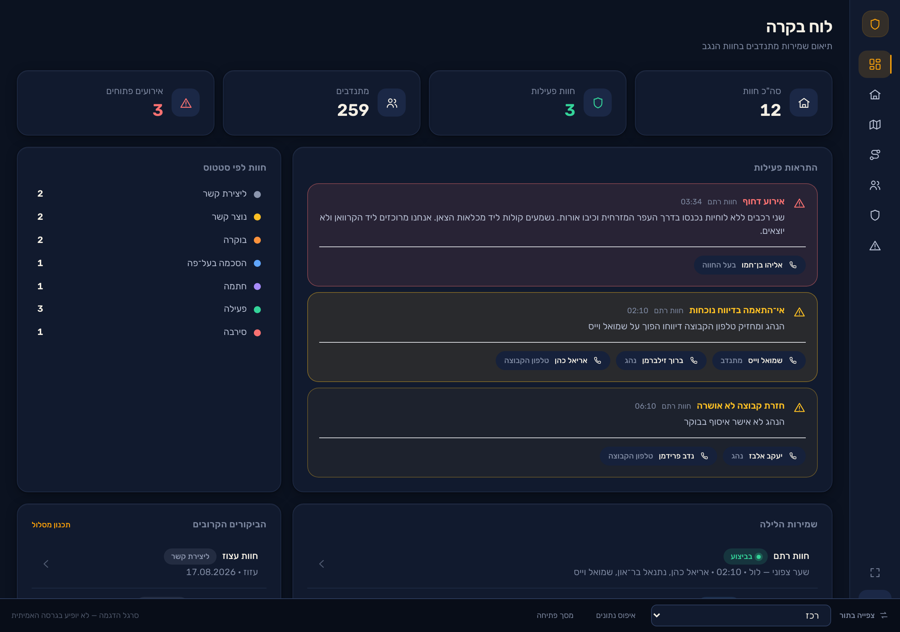

# לא ינום — Lo Yanum

> הִנֵּה לֹא יָנוּם וְלֹא יִישָׁן שׁוֹמֵר יִשְׂרָאֵל — תהלים קכ"א, ד

Coordination tool for a volunteer farm-protection programme in the Negev.
**Lot 0.5: "Night Watch" visual POC — full UI, realistic mock data, no backend.**



## Run

This machine has no Node.js; use Bun.

```bash
bun install && bun run dev
```

| Command | What it does |
|---|---|
| `bun run dev` | Dev server on http://localhost:5173 |
| `bun run build` | Typecheck + production build to `dist/` |
| `bun run typecheck` | `tsc --noEmit` |
| `bun run screenshots` | Regenerate `docs/screenshots/` (dev server must be running) |

Pick an identity on the landing screen, or switch roles any time from the bar
at the bottom of every screen.

## Architecture in one paragraph

`/src/core` is pure TypeScript with zero React and zero DOM — types, mock data,
the observable store, route planning, message generation, import validation,
and the role-filtered accessors. `/src/ui` is every React component. Screens
never filter data by role; they call an accessor in `src/core/access.ts`, each
of which maps 1:1 to a future Supabase RLS policy. All UI copy lives in
`src/locales/he.json`; every colour lives in `src/styles/tokens.css`.

## Mock data

All data is fictional. Phone numbers use the unallocated `05X-000NNNN` range so
no fixture can collide with a real number. Real emergency numbers (100/101/102)
are intentionally real.

**Full project state, design tokens, decisions and next steps: [ETAT.md](ETAT.md).**
